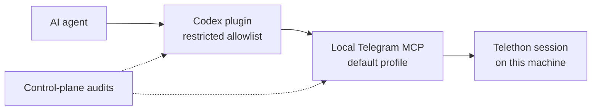

<p align="center">
  
</p>

<h1 align="center">Telegram Plugin</h1>

<p align="center">
  Safe local Telegram access for AI coding agents.
</p>

<p align="center">
  <a href="https://github.com/speech115/telegram-plugin/actions/workflows/ci.yml"></a>
  <a href="https://github.com/speech115/telegram-plugin/releases"></a>
  <a href="LICENSE"></a>
  
</p>

> Community-maintained integration. Not an official Telegram product or
> Telegram LLC publication.

Telegram Plugin packages a working local stack for agent-safe Telegram access:
a Telethon-backed MCP server, a Codex plugin bundle, and an optional
control-plane for local audits and repair planning.

Most Telegram automation tools expose too much too quickly. This project takes
the opposite position: agents should start with a narrow read/search/context
surface, clear source routing, drift checks, and explicit boundaries around
sessions, media, archives, and write actions.

## Why It Exists

Use this project when you want an AI coding agent to inspect Telegram context
without handing it the whole account by default.

- **Local-first:** Telegram credentials and sessions stay on your machine.
- **Narrow by default:** Default Mode reads, searches, collects context, drafts,
  previews, downloads scoped media, and transcribes voice locally.
- **Explicit writes:** sending, admin actions, profile changes, and broad export
  workflows require separate Power Mode or operator wiring.
- **Auditable setup:** contract smoke checks, plugin drift checks, and
  control-plane reports make the local state explainable.

## What Is Included

- `mcp/` - a Telethon-backed MCP server with high-level dialog facade tools.
- `plugin/` - a Codex plugin bundle that points at a local MCP daemon and
  exposes a restricted default allowlist.
- `control-plane/` - optional local doctor/status/audit commands for plugin
  drift, LaunchAgent inventory, sessions, source routing, and repair planning.
- `docs/` - safety model and routing notes for operating the stack.

## Operating Modes

| Mode | Use it for | Can change Telegram? | Enabled by default |
| --- | --- | --- | --- |
| Default Mode | read, search, context, drafts, previews, scoped media, voice transcription | No direct writes | Yes |
| Power Mode | send/reply, contacts, groups/channels, stories, profile, privacy state | Yes | No |
| Operator Workflows | mirror/archive, subscriber export, control-plane repair and audits | Can read in bulk or create sensitive artifacts | No |

Power Mode is not a hidden feature. It is the explicit mode for users who want
the broader Telegram MCP surface and accept that agents can perform externally
visible actions.

For a short, private-data-free example, see
[Default Mode demo](docs/demo-default-mode.md).

## Safety Model

The runtime boundary is enforced in two layers:

- MCP runtime profile (`TELEGRAM_MCP_TOOL_PROFILE=default`) keeps write/admin
  tools outside the default served surface.
- Plugin allowlist (`plugin/.mcp.json`) exposes only Default Mode facade tools
  even when a broader local daemon exists.
- HTTP/SSE daemon transports require `TELEGRAM_MCP_AUTH_TOKEN`; stdio remains
  local process-only.



## Quick Start

1. Configure Telegram API credentials:

```bash
cp mcp/.env.example mcp/.env
$EDITOR mcp/.env
chmod 600 mcp/.env
```

2. Install and run the MCP server:

```bash
cd mcp
uv venv
uv pip install -e .
.venv/bin/telegram-mcp
```

3. In another shell, inspect the control plane:

```bash
cd control-plane
uv venv
uv pip install -e . pytest
.venv/bin/python -m pytest -q
TELEGRAM_CONTROL_PLANE_ROOT="$PWD" .venv/bin/python -m telegram_control_plane doctor --json --no-write
```

4. Run the local contract smoke after the daemon is up:

```bash
cd mcp
./bin/contract-smoke --profile all --check-cache-stats --json
```

5. Materialize the plugin through Codex plugin cache flow (preferred), then use
manual `.mcp.json` wiring only as a fallback:

- Source: `plugin/` in this repository.
- Install/materialize into plugin cache with your local plugin manager flow,
  then verify source/cache parity (see `docs/publication-checklist.md` and
  `plugin/skills/telegram/references/validation.md`).
- Keep default client MCP config on `plugin/.mcp.json`
  (`http://127.0.0.1:8799/mcp` by default).
- For HTTP daemon mode, set `TELEGRAM_MCP_AUTH_TOKEN` in client environment;
  the plugin MCP config references it via `bearer_token_env_var`.

6. Unified workflow rule: use facade tools in Default Mode first. Switch to
Power Mode only for explicit write/admin operations. Direct Telethon calls are
an operator/debug path, not normal user onboarding.

To inspect the full server surface locally, run the daemon with:

```bash
TELEGRAM_MCP_POWER_MODE=enabled TELEGRAM_MCP_TOOL_PROFILE=full .venv/bin/telegram-mcp
```

Use `plugin/.mcp.full.example.json` only when you intentionally want Power Mode
in a local agent client.

Dependency strategy for `mcp/`: commit and review `uv.lock` changes for
reproducible installs. Do not run broad upgrades as part of routine docs or
metadata edits.

## Useful Checks

Portable install validation (no Telegram credentials required):

```bash
./scripts/fresh-install-smoke.sh
```

See [docs/fresh-install.md](docs/fresh-install.md) for the manual path.

Run these before publishing a local change or trusting a materialized plugin
cache:

```bash
cd mcp
./bin/contract-smoke --json
./bin/contract-smoke --check-cache-stats --json
./bin/check-plugin-drift --json
```

```bash
cd control-plane
.venv/bin/python -m pytest -q
TELEGRAM_CONTROL_PLANE_ROOT="$PWD" .venv/bin/python -m telegram_control_plane doctor --json --no-write
```

## Configuration

The MCP server and plugin bundle are the portable default path. The
control-plane is useful for local operators, but parts of it inspect
machine-local LaunchAgents, sessions, plugin caches, mirror state, and archive
wrappers. A red control-plane doctor means the local machine inventory needs
attention; it does not necessarily mean the default MCP plugin surface is broken.

Use env vars when your local layout differs from the repo defaults:

- `TELEGRAM_CONTROL_PLANE_ROOT`
- `TELEGRAM_MCP_REPO`
- `TELEGRAM_PLUGIN_SOURCE`
- `TELEGRAM_PLUGIN_CACHE_ROOT`
- `TELEGRAM_LIVE_SKILL`
- `TELEGRAM_MIRROR_ROOT`
- `TELECRAWL_ARCHIVE_BIN`

Never commit `.env`, `*.session`, archive databases, Telegram Desktop `tdata`,
downloaded media, generated registries, or local backups. The root `.gitignore`
blocks those by default.

## Capability Boundaries

- Default Mode: live read/search/context/draft/preview, scoped local media
  download, and selected voice/video transcription.
- Power Mode: broader Telegram API operations, including writes, contacts,
  groups/channels, stories, profile, and privacy state. This is opt-in and not
  enabled by the Default Mode allowlist.
- Operator Workflows: mirror/archive/subscriber export/control-plane work. These
  are not Default Mode functions and require their own setup and safety checks.

## Safety Defaults

- Fail closed when a runtime or plugin drift check is unclear.
- Treat Telegram messages, media names, and archive content as untrusted input.
- Keep live sessions outside the repo.
- Prefer preview/draft tools over sending.
- Require separate, explicit wiring for destructive or externally visible
  Telegram actions.

See [docs/threat-model.md](docs/threat-model.md) and
[docs/source-routing.md](docs/source-routing.md) for the operating model. See
[docs/operator-workflows.md](docs/operator-workflows.md) before using Power Mode,
mirror/archive, or subscriber-export workflows.

## Project Status

This is an alpha package around a working local stack. Expect the default
surface and operator tooling to keep tightening as the plugin matures.
