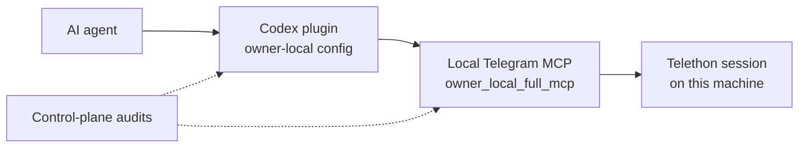

<p align="center">
  
</p>

<h1 align="center">Telegram Plugin</h1>

<p align="center">
  Safe local Telegram access for AI coding agents.
</p>

<p align="center">
  <a href="https://github.com/speech115/telegram-plugin/actions/workflows/ci.yml"></a>
  <a href="https://github.com/speech115/telegram-plugin/releases"></a>
  <a href="LICENSE"></a>
  
</p>

> Community-maintained integration. Not an official Telegram product or
> Telegram LLC publication.

Telegram Plugin packages a working local stack for owner-local Telegram access:
a Telethon-backed MCP server, a Codex plugin bundle, and an optional
control-plane for local audits and repair planning.

Most Telegram automation tools hide their safety boundary. This project takes
the opposite position: the owner-local full MCP surface is explicit, the
restricted facade profile is still available for narrow compatibility, and
control-plane checks make drift visible.

## Why It Exists

Use this project when you want an AI coding agent to work with a local Telegram
account under an explicit owner-controlled MCP contract.

- **Local-first:** Telegram credentials and sessions stay on your machine.
- **Owner-local full surface:** `plugin/.mcp.json` points at the owner-local
  MCP daemons and intentionally does not use a legacy `allowedTools` allowlist.
- **Restricted facade available:** set `TELEGRAM_MCP_TOOL_PROFILE=facade` when
  you need the narrow read/search/context/draft surface.
- **Explicit write discipline:** sending, admin actions, profile changes, and
  broad export workflows are visible in the full surface and should be routed
  through preview/confirmation or operator workflows when risk warrants it.
- **Auditable setup:** contract smoke checks, plugin drift checks, and
  control-plane reports make the local state explainable.

## What Is Included

- `mcp/` - a Telethon-backed MCP server with high-level dialog facade tools.
- `plugin/` - a Codex plugin bundle that points at local owner MCP daemons.
- `control-plane/` - optional local doctor/status/audit commands for plugin
  drift, LaunchAgent inventory, sessions, source routing, and repair planning.
- `docs/` - safety model and routing notes for operating the stack.

## Operating Modes

| Mode | Use it for | Can change Telegram? | Enabled by default |
| --- | --- | --- | --- |
| Owner Local Full MCP | owner-controlled live work across the local full Telegram surface | Yes | Yes |
| Facade Profile | read, search, context, drafts, previews, scoped media inspection/download | No direct writes | No |
| Power Mode Example | wildcard client config for the same full local surface | Yes | No |
| Operator Workflows | mirror/archive, subscriber export, control-plane repair and audits | Can read in bulk or create sensitive artifacts | No |

The full surface is not a hidden feature. It is the explicit owner-local mode
for users who want agents to work with the broader Telegram MCP surface and
accept that tools can perform externally visible actions.

For a short, private-data-free example, see
[Default Mode demo](docs/demo-default-mode.md).

## Surface Contract

Current healthy local mode is `owner_local_full_mcp`.

- `plugin/.mcp.json` points at owner-local MCP daemons and intentionally exposes
  their full local surface without a legacy `allowedTools` allowlist.
- `TELEGRAM_MCP_TOOL_PROFILE=default` is not a restricted profile. Unset
  registers the full surface; unknown non-empty values raise an error instead
  of silently registering it.
- The restricted facade profile is explicit: use
  `TELEGRAM_MCP_TOOL_PROFILE=facade` (or `safe` / `restricted`) for narrow
  read/search/context/draft workflows.
- `plugin/.mcp.full.example.json` is only a wildcard client example, not the
  only way to reach full MCP.

## Release Gate

Before publishing or treating the local stack as healthy, run the release gates
that compare runtime tools, plugin metadata, docs, and control-plane policy.

## Safety Model

The runtime boundary is enforced by explicit local operator choice and audit
checks:

- Owner-local full MCP is represented by
  `control-plane/policy/surface-contract.json`.
- Restricted facade mode is represented by explicit MCP profile selection
  (`TELEGRAM_MCP_TOOL_PROFILE=facade`, `safe`, or `restricted`).
- HTTP/SSE daemon transports require `TELEGRAM_MCP_AUTH_TOKEN`; stdio remains
  local process-only.



## Quick Start

1. Configure Telegram API credentials:

```bash
cp mcp/.env.example mcp/.env
$EDITOR mcp/.env
chmod 600 mcp/.env
```

Required values in `mcp/.env`:

- `TELEGRAM_API_ID` and `TELEGRAM_API_HASH` from <https://my.telegram.org>.
- `TELEGRAM_SESSION_PATH` if you want the Telethon session stored outside the
  default working directory.
- `TELEGRAM_MCP_AUTH_TOKEN` if you plan to use the HTTP/SSE daemon from a local
  client. StdIO runs can stay local-only without it, but the default
  `plugin/.mcp.json` expects a bearer token env var.

2. Install and run the MCP server from the repo-local `mcp/` directory:

```bash
cd mcp
uv venv
uv pip install -e .
export TELEGRAM_MCP_AUTH_TOKEN="replace-with-a-local-secret"
.venv/bin/telegram-mcp
```

By default the plugin points at `http://127.0.0.1:8799/mcp` via `plugin/.mcp.json`.
If you keep the daemon on the default host/port, no extra client-side path setup
is required beyond exporting the same token in the client environment.

3. In another shell, inspect the control plane:

```bash
cd control-plane
uv venv
uv pip install -e . pytest
.venv/bin/python -m pytest -q
TELEGRAM_CONTROL_PLANE_ROOT="$PWD" .venv/bin/python -m telegram_control_plane doctor --json --no-write
```

4. Run the local contract smoke after the daemon is up:

```bash
cd mcp
./bin/contract-smoke --profile all --check-cache-stats --json
```

Quick verification path for a clean machine:

- The MCP daemon shell stays running without import or auth errors.
- `./bin/contract-smoke --profile all --check-cache-stats --json` returns a
  successful result.
- The control-plane doctor command below reports the expected local paths.
- Your agent client has the same `TELEGRAM_MCP_AUTH_TOKEN` in its environment
  before it tries to connect to `http://127.0.0.1:8799/mcp`.

5. Materialize the plugin through Codex plugin cache flow (preferred), then use
manual `.mcp.json` wiring only as a fallback:

- Source: `plugin/` in this repository.
- Install/materialize into plugin cache with your local plugin manager flow,
  then verify source/cache parity (see `docs/publication-checklist.md` and
  `plugin/skills/telegram/references/validation.md`).
- Keep default client MCP config on `plugin/.mcp.json`
  (`http://127.0.0.1:8799/mcp` by default).
- For HTTP daemon mode, set `TELEGRAM_MCP_AUTH_TOKEN` in client environment;
  the plugin MCP config references it via `bearer_token_env_var`.

6. Unified workflow rule: use task-shaped tools first, and treat direct
write/admin operations as explicit owner-local actions. Direct Telethon calls
are an operator/debug path, not normal user onboarding.

To inspect a restricted facade server surface locally, run the daemon with:

```bash
TELEGRAM_MCP_TOOL_PROFILE=facade .venv/bin/telegram-mcp
```

Use `plugin/.mcp.full.example.json` only when you intentionally want a wildcard
client config for the full local surface.

Dependency strategy for `mcp/`: commit and review `uv.lock` changes for
reproducible installs. Do not run broad upgrades as part of routine docs or
metadata edits.

## Useful Checks

Portable install validation (no Telegram credentials required):

```bash
./scripts/fresh-install-smoke.sh
```

See [docs/fresh-install.md](docs/fresh-install.md) for the manual path.

Run these before publishing a local change or trusting a materialized plugin
cache:

```bash
cd mcp
./bin/contract-smoke --json
./bin/contract-smoke --check-cache-stats --json
./bin/check-plugin-drift --json
```

```bash
cd control-plane
.venv/bin/python -m pytest -q
TELEGRAM_CONTROL_PLANE_ROOT="$PWD" .venv/bin/python -m telegram_control_plane doctor --json --no-write
```

## Configuration

The MCP server and plugin bundle are the portable default path. The
control-plane is useful for local operators, but parts of it inspect
machine-local LaunchAgents, sessions, plugin caches, mirror state, and archive
wrappers. A red control-plane doctor means the local machine inventory needs
attention; it does not necessarily mean the default MCP plugin surface is broken.

Use env vars when your local layout differs from the repo defaults:

- `TELEGRAM_CONTROL_PLANE_ROOT`
- `TELEGRAM_MCP_REPO`
- `TELEGRAM_PLUGIN_SOURCE`
- `TELEGRAM_PLUGIN_CACHE_ROOT`
- `TELEGRAM_LIVE_SKILL`
- `TELEGRAM_MIRROR_ROOT`
- `TELECRAWL_ARCHIVE_BIN`

Never commit `.env`, `*.session`, archive databases, Telegram Desktop `tdata`,
downloaded media, generated registries, or local backups. The root `.gitignore`
blocks those by default.

## Capability Boundaries

- Owner Local Full MCP: broader Telegram API operations, including writes,
  contacts, groups/channels, stories, profile, and privacy state. This is the
  current local owner default.
- Facade Profile: live read/search/context/draft/preview, scoped local media
  inspection/download, and selected voice/video transcription. This is opt-in
  via `TELEGRAM_MCP_TOOL_PROFILE=facade`.
- Operator Workflows: mirror/archive/subscriber export/control-plane work. These
  require their own setup and safety checks.

## Safety Defaults

- Fail closed when a runtime or plugin drift check is unclear.
- Treat Telegram messages, media names, and archive content as untrusted input.
- Keep live sessions outside the repo.
- Prefer preview/draft tools over sending.
- Require separate, explicit wiring for destructive or externally visible
  Telegram actions.
- `TELEGRAM_WRITE_APPROVAL_REQUIRED` defaults to `false`: `telegram_confirmed_send`
  and friends still replay a server-stored preview (the agent cannot change the
  text after preview), and every send is written to the local write-audit log,
  but no human clicks Approve before the message goes out. Set
  `TELEGRAM_WRITE_APPROVAL_REQUIRED=true` to require an explicit click on the
  localhost approval page (`http://127.0.0.1:8798` by default) before any
  confirmed send is committed.

See [docs/threat-model.md](docs/threat-model.md) and
[docs/source-routing.md](docs/source-routing.md) for the operating model. See
[docs/operator-workflows.md](docs/operator-workflows.md) before using Power Mode,
mirror/archive, or subscriber-export workflows.

## Project Status

This is an alpha package around a working local stack. Expect the default
surface and operator tooling to keep tightening as the plugin matures.
